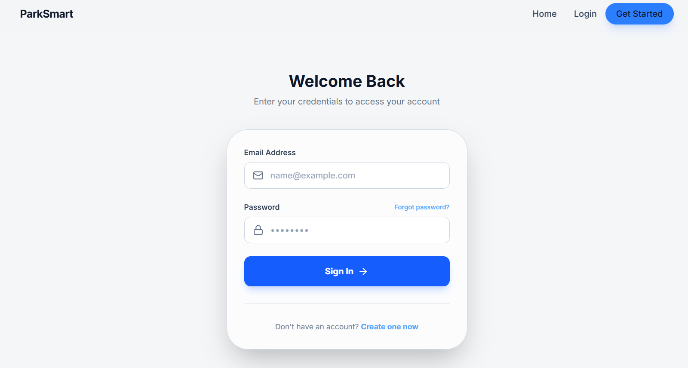
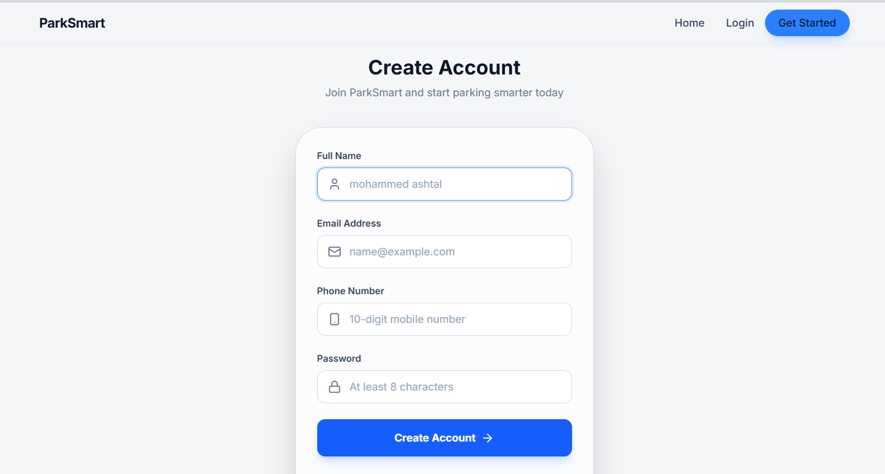
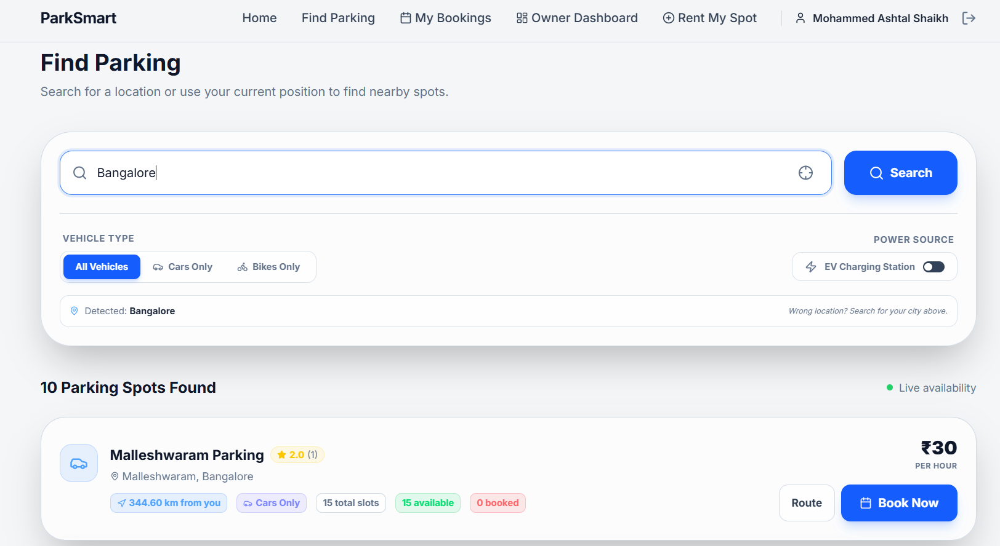
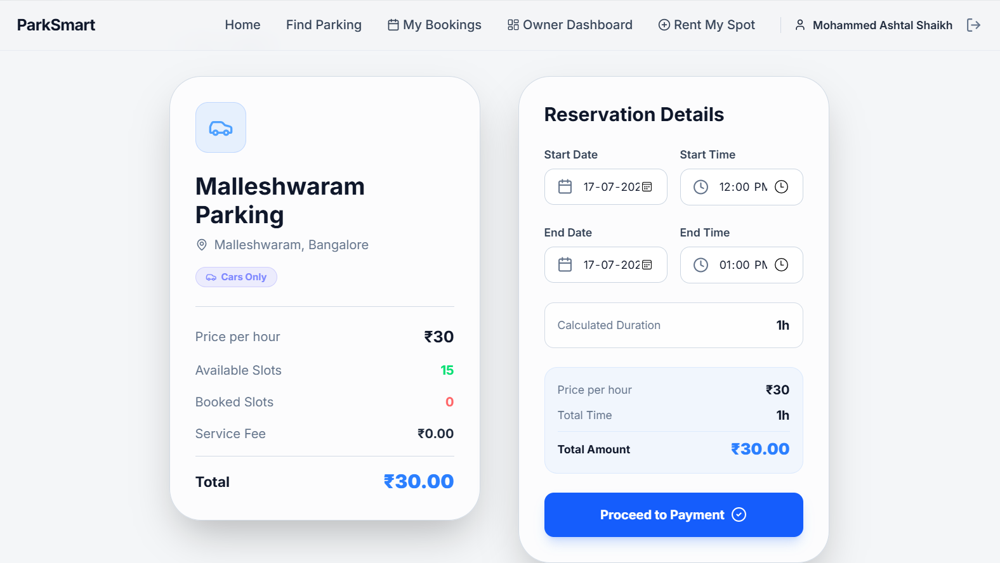
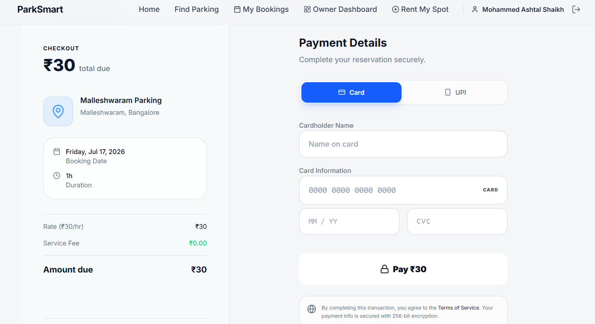

# Smart Parking Reservation System

## Overview

The **Smart Parking Reservation System** is a web-based application designed to simplify the process of finding and reserving parking spaces. The system allows users to view available parking slots in real time, reserve a parking space in advance, and manage their bookings efficiently. It helps reduce the time spent searching for parking while improving parking space utilization.

---

## Features

- User Registration and Login
- Secure Authentication
- Real-Time Parking Slot Availability
- Online Parking Slot Reservation
- Booking Management
- Reservation Cancellation
- Owner Dashboard
- Parking Slot Management
- User Management
- Booking History
- Responsive User Interface

---

## Technologies Used

### Frontend
- HTML5
- CSS3
- JavaScript
- React

### Backend
- Nodejs
- Expressjs

### Database
- SQLite

### Development Tools
- Visual Studio Code
---

## System Modules

### User Module
- Register a new account
- Login securely
- View available parking slots
- Reserve parking spaces
- Cancel reservations
- View booking history

### Owner Module
- Add, update, and delete parking slots
- Manage users
- Monitor reservations
- View system statistics

---

## Project Workflow

1. User registers and logs into the system.
2. The system displays available parking slots.
3. User selects a preferred parking slot.
4. User confirms the reservation.
5. The system stores the booking details in the database.
6. User can view or cancel reservations.
7. Owner manages parking slots and monitors bookings.

---

## Database Tables

- Users
- Parking Slots
- Reservations
- Parking Lot
- Payment
- Reviews

---

## Advantages

- Saves time in finding parking spaces.
- Reduces traffic congestion caused by parking searches.
- Easy reservation process.
- Efficient parking space management.
- User-friendly interface.
- Real-time slot availability.

---

## Future Enhancements

- QR Code-based parking entry
- GPS navigation to reserved parking slot
- Email and SMS notifications
- Mobile application (Android/iOS)
- AI-based parking prediction
- Digital wallet integration

---

## Installation

1. Install VS code.
2. Download the **ZIP** file from **park-main** .
3. Extract and Open in VS code.
4. Install SQL DB for Database.
5. Update database credentials in the project configuration file.
6. Open your browser and visit.

---

## Requirements

- Intel i3 or above
- Minimum 200 mb free storage
- VS code or Any code editor
- Modern Web Browser
- 
---

## Screenshots

Add screenshots of the following pages:

- Home Page
  
- Login Page
  
- Registration Page
  
- Search Page
  
- Parking Slot Booking
  
- Payment Page
  
- Booking History
  
- Lot Listing Page
  
- Owner Dashboard
  

---

## Conclusion

The Smart Parking Reservation System provides an efficient and user-friendly solution for managing parking reservations. It enables users to reserve parking spaces conveniently while allowing administrators to manage parking operations effectively. The system reduces manual effort, improves parking utilization, and enhances the overall user experience.

---

## Author

**Name:** Mohammed Ashtal

**Course:** Bachelor of Computer Applications (BCA)

**University:** Karnataka University Dharwad (KUD)

**Academic Year:** 2023–2026

---

## License

This project is developed for educational purposes only.
